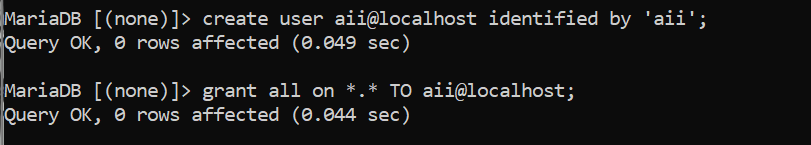
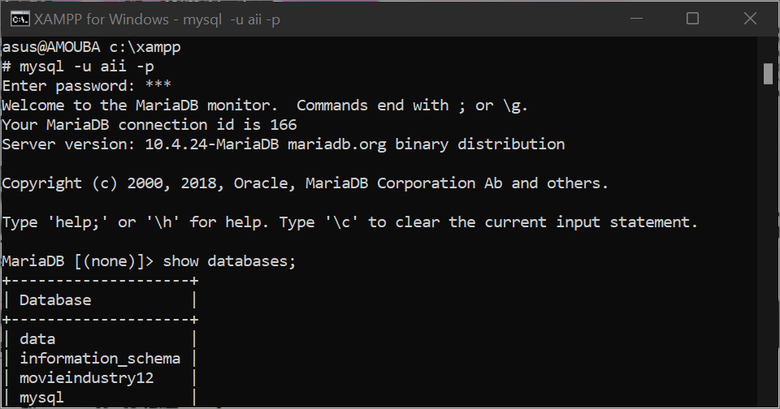
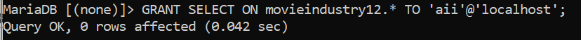
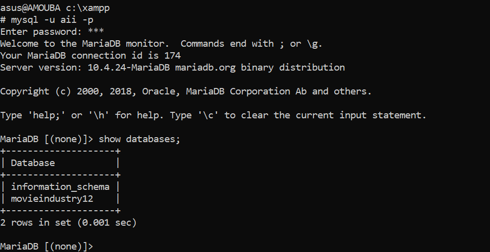
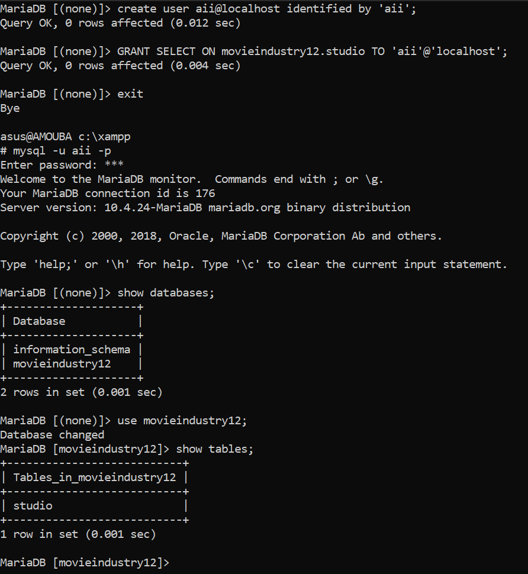
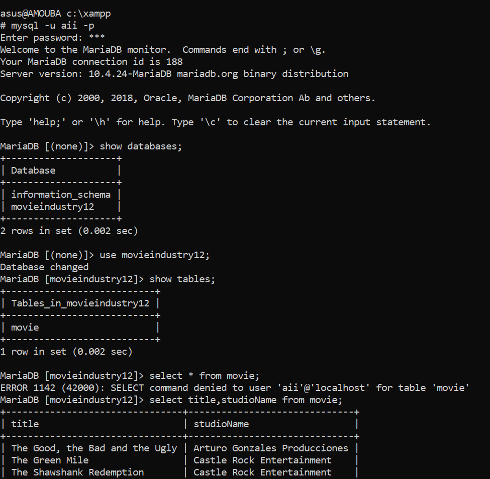

**Laporan ACL Mysql Keamanan Basis Data**

NIM : 4332101010

Nama : Khairul

Kelas : RKS 3A -- Pagi

A.  Jenis Hak Akses pada Mysql Berdasarkan Cakupan Akses Level

Jika didasarkan pada pengelompokkan ini, kita dapat membagi hak akses
MySQL menjadi 4 level tingkatan, yaitu:

1)  Hak Akses Global ( \*.\* )

> Hak akses ini berarti user dapat memiliki hak akses untuk seluruh
> database yang terdapat di dalam MySQL. Contoh penulisan query GRANT
> untuk level ini adalah:
>
> **"GRANT SELECT ON \*.\* TO \'user\'@\'localhost\'; "**
>
> {width="5.632234251968504in"
> height="1.0069958442694664in"}
>
> {width="5.631884295713036in"
> height="2.956738845144357in"}
>
> Analisa : dilihat dari command di atas, user aii diberikan akses
> secara global yaitu setara dengan user root, semua database bisa di
> akses.

2)  Hak Akses Level Databases (nama_database)

> Hak akses ini berarti user memiliki hak akses penuh untuk sebuah
> database. Contoh penulisan query **GRANT** untuk level database ini
> adalah:
>
> **"GRANT SELECT ON universitas.\* TO \'user\'@\'localhost\'; "**
>
> {width="5.750295275590551in"
> height="0.39585411198600173in"}
>
> {width="5.782608267716536in"
> height="2.9764293525809276in"}
>
> Analisa : dilihat dari command diatas user aii hanya diberikan hak
> akses untuk database movieindustry12, sementara database yang lain
> tidak diberikan akses.

3)  Hak Akses Level Table (nama_database.nama_table)

> Hak akses ini berarti user memiliki hak akses untuk sebuah tabel yang
> berada pada sebuah database. Contoh penulisan query GRANT untuk level
> ini adalah:
>
> **"GRANT SELECT ON nama_database.nama_table TO \'user\'@\'localhost\';
> "**
>
> {width="5.571945538057743in"
> height="6.059178696412949in"}
>
> Analisa : dilihat dari command diatas, user aii hanya diberikan akses
> di table studio di database movieindustry12.

4)  Hak Akses Level Kolom (nama_kolom)

> Hak akses ini adalah hak akses paling kecil yang dapat diberikan
> kepada sebuah user. Dengan hak akses level kolom, user hanya memiliki
> hak akses untuk beberapa kolom pada sebuah tabel. Contoh penulisan
> query GRANT untuk level kolom ini adalah:
>
> **"GRANT SELECT (title,studioName) ON movieindustry12.movie TO
> \'aii\'@\'localhost\'; "**
>
> {width="4.249998906386701in"
> height="4.14974300087489in"}
>
> Analisa : dari command diatas, user diberikan hak akses hanya pada
> kolom title dan studioName di table movie dari database
> movieindustry12.

Referensi :

[Jenis-jenis Hak Akses (Privileges) dalam MySQL - Tutorial Belajar MySQL
\|
Duniailkom](https://www.duniailkom.com/jenis-jenis-hak-akses-privileges-dalam-mysql/#:~:text=Jika%20didasarkan%20pada%20pengelompokkan%20ini%2C%20kita%20dapat%20membagi,...%204%204.%20Hak%20Akses%20Level%20Kolom%20%28nama_kolom%29)
